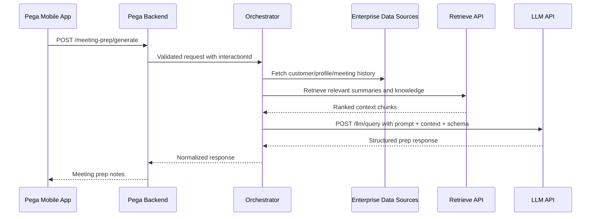
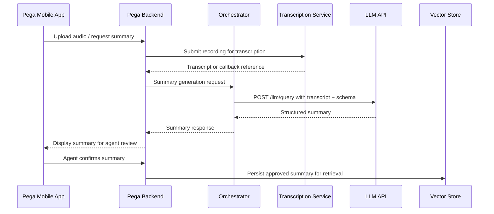
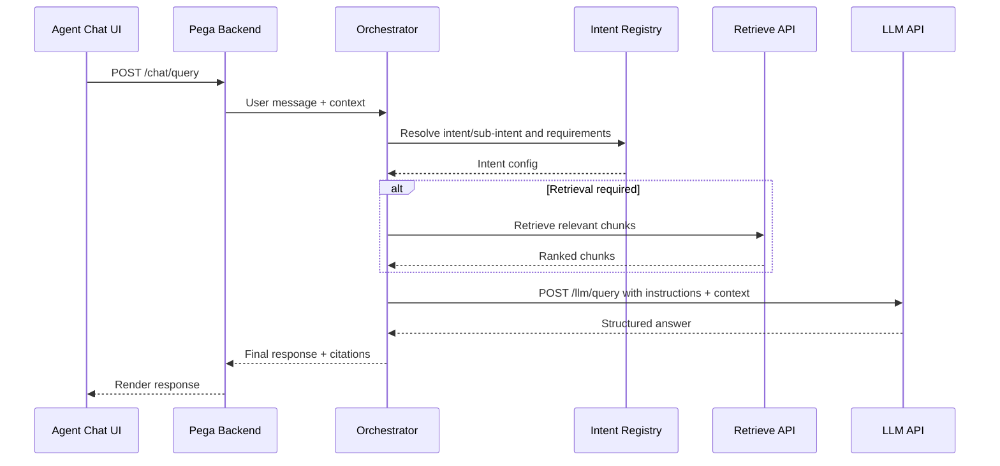

# AI Project Design Consolidation

## Document status
This markdown consolidates the latest AI project design decisions and artifacts visible from the prior GPT discussions available in this conversation history.

Where an earlier exact artifact was not fully available verbatim, the content below is reconstructed from the latest visible decisions and refinements.

---

## 1. Project scope overview
The AI initiative supports insurance-agent-facing use cases with a shared orchestration pattern across:
- Meeting preparation notes
- Meeting summary generation from transcript
- Agent chatbot / knowledge and action assistant

Core platform areas discussed:
- Pega mobile front end / iPad app
- Pega backend for session, UX, workflow and slot filling
- Orchestrator layer for intent-to-tool/model/prompt routing
- Retrieval API for semantic search over enterprise content
- LLM API for structured generation
- ASR / transcription integration for meeting recordings
- Vector store / embeddings for RAG
- Guardrails, observability and cost controls

---

## 2. Latest key design decisions

### 2.1 API strategy
Adopt separate business-facing endpoints by use case, plus shared internal AI endpoints:
- `POST /meeting-prep/generate`
- `POST /chat/query`
- `POST /meeting-summary/generate`
- `POST /retrieve`
- `POST /llm/query`

Rationale:
- Cleaner contract per UI journey
- Easier product ownership and access control
- Still allows reuse through shared internal retrieve and llm APIs
- Avoids forcing one oversized public endpoint for all use cases

### 2.2 Orchestrator ownership
The orchestrator should own runtime mapping of:
- intent/sub-intent
- minimum input requirements
- required tools/data sources
- model profile selection
- prompt template resolution
- output schema selection

Reasoning:
- Centralized execution control across use cases
- Better auditability and version control
- Clear separation between application orchestration and model-serving platform
- AI/LLM team can still own model behavior, prompt guidance standards, guardrails and API capabilities

### 2.3 Intent handling strategy
Recommended hybrid approach:
- Fixed-intent journeys for meeting prep and meeting summary
- Registry-driven intent/sub-intent for chatbot
- Simple deterministic intent classification where practical
- LLM-assisted classification only for ambiguous or open-ended requests among predefined intents
- Default fallback / denial response for out-of-scope or unsupported intents

### 2.4 Response design principle
Response contracts should be generalized enough to support multiple intents, but still structured.
Recommended pattern:
- Common response envelope for all endpoints
- Structured `contentBlocks` / `sections` for text outputs
- Optional typed payloads for non-text cards, lists, tables, JSON objects
- Avoid brittle per-intent bespoke top-level contracts where possible

### 2.5 Confidence handling
Do not expose a simplistic confidence object in all responses by default.
Instead:
- use orchestrator-level fallback/regeneration logic where needed
- expose provenance/citations and guardrail indicators where useful
- optionally track internal scoring for observability, not mandatory UI payload

### 2.6 Correlation identifiers
Include identifiers to trace an end-to-end journey:
- `requestId` for single API request
- `interactionId` to correlate one user interaction across services
- `conversationId` for multi-turn chat continuity
- optional `sessionId` if UI/session lifecycle needs separate tracking

Latest preference explicitly mentioned:
- include `interactionId` in all API contracts
- do not include `quality` object as a mandatory response field

### 2.7 Retrieval design
`/retrieve` is a dedicated internal API for semantic chunk retrieval for chatbot and RAG use cases.
The LLM should not directly own retrieval. Retrieval remains a separate service concern for:
- chunking / embedding strategy independence
- retrievability tuning
- observability and performance measurement
- reuse by multiple downstream consumers

### 2.8 Knowledge source strategy
For knowledge document ingestion and RAG:
- SharePoint document library was considered a suitable repository alternative where direct KM authoring is unnecessary
- A custom ingestion pipeline can vectorize documents with metadata into vector DB
- Downloadable hyperlinks in chat can point back to original SharePoint document URLs

### 2.9 Guardrails and cost capping
Guardrails should be applied in multiple layers:
- input/output validation in orchestrator
- provider/model-level moderation or policy tools if available
- prompt-level restrictions
- response schema enforcement

Cost control considerations:
- model tier routing (`FAST | STANDARD | DEEP_THINK`)
- token caps
- retrieval caps and chunk limits
- caching where safe
- throttling / budget monitoring

### 2.10 Async vs sync execution
Although many sequence diagrams may show synchronous calls, some flows may become asynchronous, including:
- transcription completion callbacks / polling
- ingestion/vectorization workflows
- post-confirmation persistence of meeting summary to vector store
- long-running research or enrichment tasks

---

## 3. Target architecture

### 3.1 Logical component view
1. **UI layer**
   - Pega Mobile / iPad App
   - Web UI for KM/document maintenance if applicable

2. **Pega backend**
   - Chat session handling
   - Slot filling / minimum-input collection
   - Basic intent routing if deterministic rules exist
   - Integration with orchestrator

3. **Orchestrator layer**
   - Intent registry lookup
   - Tool determination
   - Input validation
   - Context gathering
   - Prompt assembly
   - Retrieval call
   - LLM call
   - Guardrail enforcement
   - Structured response shaping

4. **AI/data layer**
   - LLM API provider
   - Retrieval API
   - Embedding model
   - Vector DB
   - ASR/transcription provider
   - Guardrail services

5. **Enterprise support systems**
   - Agent/customer profile sources
   - CRM / policy / claims / engagement data
   - Document repositories
   - Observability stack

---

## 4. Master API contract for shared `POST /llm/query`

This is the latest generalized version based on the visible refinements.

### 4.1 Compact request contract
```json
{
  "requestId": "string",
  "interactionId": "string",
  "timestamp": "datetime",
  "channel": "string",
  "intent": {
    "primaryIntent": "string",
    "secondaryIntent": "string"
  },
  "conversationContext": {
    "conversationId": "string",
    "olderConversationSummary": "string",
    "recentIterations": [
      {
        "iterationNumber": "number",
        "userMessage": "string",
        "assistantResponse": "string",
        "timestamp": "datetime"
      }
    ]
  },
  "modelConfig": {
    "processingMode": "FAST | STANDARD | DEEP_THINK",
    "maxOutputTokens": "number"
  },
  "prompt": {
    "promptTemplateId": "string",
    "promptTemplateVersion": "string",
    "systemInstruction": "string",
    "developerInstruction": "string",
    "userInstruction": "string"
  },
  "grounding": {
    "retrievedContext": [
      {
        "sourceId": "string",
        "sourceType": "string",
        "title": "string",
        "snippet": "string",
        "metadata": {
          "key": "value"
        }
      }
    ]
  },
  "outputSchema": {
    "schemaName": "string",
    "schemaVersion": "string",
    "responseFormat": "TEXT | JSON"
  },
  "requestMetadata": {
    "userId": "string",
    "locale": "string",
    "clientApp": "string"
  }
}
```

### 4.2 Compact response contract
```json
{
  "requestId": "string",
  "interactionId": "string",
  "timestamp": "datetime",
  "status": "SUCCESS | PARTIAL_SUCCESS | FAILED",
  "intent": {
    "primaryIntent": "string",
    "secondaryIntent": "string"
  },
  "response": {
    "title": "string",
    "contentBlocks": [
      {
        "type": "TEXT | LIST | TABLE | CARD | JSON",
        "title": "string",
        "body": "string",
        "data": {}
      }
    ]
  },
  "citations": [
    {
      "sourceId": "string",
      "title": "string",
      "url": "string",
      "snippet": "string"
    }
  ],
  "usage": {
    "model": "string",
    "inputTokens": "number",
    "outputTokens": "number"
  },
  "error": {
    "code": "string",
    "message": "string"
  }
}
```

### 4.3 Field descriptions

#### Request fields
- `requestId`: unique id for this API request.
- `interactionId`: correlates all service calls for one user interaction.
- `timestamp`: request creation time.
- `channel`: source channel such as mobile, web, chatbot.
- `intent.primaryIntent`: top-level requested capability.
- `intent.secondaryIntent`: sub-intent or finer routing label.
- `conversationContext.conversationId`: multi-turn conversation identifier.
- `conversationContext.olderConversationSummary`: summarized prior context.
- `conversationContext.recentIterations`: recent user/assistant turns for local continuity.
- `modelConfig.processingMode`: requested model tier.
- `modelConfig.maxOutputTokens`: max tokens for model response.
- `prompt.promptTemplateId`: identifier of prompt template.
- `prompt.promptTemplateVersion`: prompt version for traceability.
- `prompt.systemInstruction`: system-level instruction.
- `prompt.developerInstruction`: application/developer guidance.
- `prompt.userInstruction`: final user-facing task instruction.
- `grounding.retrievedContext`: retrieved documents/chunks or external facts.
- `outputSchema`: expected output shape.
- `requestMetadata`: auxiliary metadata such as user, locale, client app.

#### Response fields
- `requestId`: echoes request id.
- `interactionId`: echoes interaction correlation id.
- `timestamp`: response generation timestamp.
- `status`: overall execution result.
- `intent`: resolved intent labels used for execution.
- `response.title`: primary response title.
- `response.contentBlocks`: ordered structured output blocks.
- `citations`: supporting sources used in response.
- `usage`: model and token usage for observability/cost.
- `error`: failure information when applicable.

---

## 5. Business-facing API contracts

## 5.1 `POST /meeting-summary/generate`
Generate structured meeting summary from transcript.

### Request
```json
{
  "requestId": "string",
  "interactionId": "string",
  "timestamp": "datetime",
  "meeting": {
    "meetingId": "string",
    "audioId": "string",
    "transcript": "string",
    "language": "string",
    "participants": [
      {
        "participantId": "string",
        "displayName": "string",
        "role": "AGENT | CUSTOMER | UNKNOWN"
      }
    ]
  },
  "summaryConfig": {
    "summaryType": "ATTRIBUTE | EXECUTIVE | FULL",
    "sectionsRequired": ["string"],
    "maxOutputTokens": "number"
  },
  "customerContext": {
    "customerId": "string",
    "policyIds": ["string"]
  },
  "preferences": {
    "outputFormat": "STRUCTURED_JSON"
  }
}
```

### Response
```json
{
  "requestId": "string",
  "interactionId": "string",
  "timestamp": "datetime",
  "status": "SUCCESS | PARTIAL_SUCCESS | FAILED",
  "meetingId": "string",
  "summary": {
    "title": "Meeting Summary",
    "contentBlocks": [
      {
        "type": "TEXT",
        "title": "Key Discussion Points",
        "body": "string"
      },
      {
        "type": "LIST",
        "title": "Action Items",
        "data": [
          {
            "owner": "string",
            "action": "string",
            "dueDate": "date"
          }
        ]
      }
    ]
  },
  "citations": [],
  "usage": {
    "model": "string",
    "inputTokens": "number",
    "outputTokens": "number"
  },
  "error": {
    "code": "string",
    "message": "string"
  }
}
```

## 5.2 `POST /meeting-prep/generate`
Generate meeting preparation notes using profile, prior summaries and relevant data.

### Request
```json
{
  "requestId": "string",
  "interactionId": "string",
  "timestamp": "datetime",
  "agent": {
    "agentId": "string"
  },
  "customer": {
    "customerId": "string"
  },
  "meeting": {
    "meetingId": "string",
    "meetingDateTime": "datetime"
  },
  "inputs": {
    "customerProfile": {},
    "pastMeetingSummaries": [
      {
        "meetingId": "string",
        "summary": "string"
      }
    ],
    "additionalDataPoints": {}
  },
  "prepConfig": {
    "sectionsRequired": [
      "AGENDA",
      "CUSTOMER_INSIGHTS",
      "RISKS",
      "OPPORTUNITIES",
      "FOLLOW_UPS"
    ],
    "maxOutputTokens": "number"
  }
}
```

### Response
```json
{
  "requestId": "string",
  "interactionId": "string",
  "timestamp": "datetime",
  "status": "SUCCESS | PARTIAL_SUCCESS | FAILED",
  "meetingPrep": {
    "title": "Meeting Preparation Notes",
    "contentBlocks": [
      {
        "type": "TEXT",
        "title": "Suggested Agenda",
        "body": "string"
      },
      {
        "type": "TEXT",
        "title": "Customer Insights",
        "body": "string"
      },
      {
        "type": "LIST",
        "title": "Follow-up Points",
        "data": ["string"]
      }
    ]
  },
  "citations": [
    {
      "sourceId": "string",
      "title": "string",
      "snippet": "string"
    }
  ],
  "usage": {
    "model": "string",
    "inputTokens": "number",
    "outputTokens": "number"
  },
  "error": {
    "code": "string",
    "message": "string"
  }
}
```

## 5.3 `POST /chat/query`
Agent-facing chatbot endpoint.

### Request
```json
{
  "requestId": "string",
  "interactionId": "string",
  "timestamp": "datetime",
  "conversationId": "string",
  "user": {
    "userId": "string",
    "role": "AGENT"
  },
  "message": {
    "text": "string",
    "normalizedText": "string"
  },
  "context": {
    "customerId": "string",
    "policyId": "string",
    "recentConversationSummary": "string"
  },
  "preferences": {
    "responseFormat": "STRUCTURED",
    "maxOutputTokens": "number"
  }
}
```

### Response
```json
{
  "requestId": "string",
  "interactionId": "string",
  "timestamp": "datetime",
  "status": "SUCCESS | PARTIAL_SUCCESS | FAILED",
  "resolvedIntent": {
    "primaryIntent": "string",
    "secondaryIntent": "string"
  },
  "response": {
    "title": "string",
    "contentBlocks": [
      {
        "type": "TEXT | LIST | CARD | TABLE | JSON",
        "title": "string",
        "body": "string",
        "data": {}
      }
    ]
  },
  "citations": [
    {
      "sourceId": "string",
      "title": "string",
      "url": "string",
      "snippet": "string"
    }
  ],
  "followUpQuestions": ["string"],
  "error": {
    "code": "string",
    "message": "string"
  }
}
```

## 5.4 `POST /retrieve`
Semantic retrieval API for chatbot and RAG.

### Request
```json
{
  "requestId": "string",
  "interactionId": "string",
  "timestamp": "datetime",
  "query": {
    "text": "string",
    "intent": "string",
    "filters": {
      "documentType": ["string"],
      "product": ["string"],
      "audience": ["AGENT"],
      "language": ["string"]
    }
  },
  "retrievalConfig": {
    "topK": "number",
    "minScore": "number",
    "searchType": "SEMANTIC | HYBRID",
    "returnChunks": true,
    "includeMetadata": true
  }
}
```

### Response
```json
{
  "requestId": "string",
  "interactionId": "string",
  "timestamp": "datetime",
  "status": "SUCCESS | PARTIAL_SUCCESS | FAILED",
  "results": [
    {
      "chunkId": "string",
      "documentId": "string",
      "documentTitle": "string",
      "content": "string",
      "score": "number",
      "metadata": {
        "sourceUrl": "string",
        "page": "number",
        "tags": ["string"]
      }
    }
  ],
  "error": {
    "code": "string",
    "message": "string"
  }
}
```

---

## 6. Example contracts for three use cases

### 6.1 Meeting summary from transcript (example)
```json
{
  "requestId": "req-001",
  "interactionId": "int-001",
  "timestamp": "2026-04-13T10:00:00Z",
  "meeting": {
    "meetingId": "mtg-1001",
    "audioId": "aud-9001",
    "transcript": "Agent: Good morning... Customer: I want to review my retirement coverage...",
    "language": "en",
    "participants": [
      { "participantId": "p1", "displayName": "Agent Tan", "role": "AGENT" },
      { "participantId": "p2", "displayName": "Mr Lim", "role": "CUSTOMER" }
    ]
  },
  "summaryConfig": {
    "summaryType": "FULL",
    "sectionsRequired": ["DISCUSSION_POINTS", "CUSTOMER_NEEDS", "ACTION_ITEMS", "RISKS"],
    "maxOutputTokens": 1200
  },
  "customerContext": {
    "customerId": "cust-7788",
    "policyIds": ["pol-100", "pol-101"]
  },
  "preferences": {
    "outputFormat": "STRUCTURED_JSON"
  }
}
```

### 6.2 Meeting preparation notes (example)
```json
{
  "requestId": "req-002",
  "interactionId": "int-002",
  "timestamp": "2026-04-13T10:05:00Z",
  "agent": { "agentId": "agt-101" },
  "customer": { "customerId": "cust-7788" },
  "meeting": {
    "meetingId": "mtg-1002",
    "meetingDateTime": "2026-04-15T09:00:00+08:00"
  },
  "inputs": {
    "customerProfile": {
      "lifeStage": "pre-retirement",
      "priority": "wealth protection"
    },
    "pastMeetingSummaries": [
      { "meetingId": "mtg-0990", "summary": "Customer interested in retirement income planning." },
      { "meetingId": "mtg-0995", "summary": "Discussed education plan maturity and reallocating funds." }
    ],
    "additionalDataPoints": {
      "propensitySignals": ["high annuity interest"],
      "serviceAlerts": ["nominee update pending"]
    }
  },
  "prepConfig": {
    "sectionsRequired": ["AGENDA", "CUSTOMER_INSIGHTS", "OPPORTUNITIES", "RISKS", "FOLLOW_UPS"],
    "maxOutputTokens": 1000
  }
}
```

### 6.3 Chatbot (example)
```json
{
  "requestId": "req-003",
  "interactionId": "int-003",
  "timestamp": "2026-04-13T10:10:00Z",
  "conversationId": "conv-7001",
  "user": {
    "userId": "agt-101",
    "role": "AGENT"
  },
  "message": {
    "text": "What riders can I recommend for a customer with young children and existing hospitalization plan?",
    "normalizedText": "what riders can i recommend for customer with young children and existing hospitalization plan"
  },
  "context": {
    "customerId": "cust-7788",
    "policyId": "pol-101",
    "recentConversationSummary": "User previously asked about protection gap analysis."
  },
  "preferences": {
    "responseFormat": "STRUCTURED",
    "maxOutputTokens": 800
  }
}
```

---

## 7. Intent registry

Below is the consolidated registry structure and an initial populated list for agent chatbot plus fixed use cases.

### 7.1 Recommended columns
- Use case
- Intent
- Sub-intent
- Intent description
- Example utterances
- Minimum input requirements
- Optional input enrichments
- Tools / data sources required
- Model need (`FAST | STANDARD | DEEP_THINK`, token cap)
- System prompt reference
- Developer instruction reference
- Output schema
- Response preferences
- Fallback behavior
- Access / audience restrictions

### 7.2 Registry table

| Use case | Intent | Sub-intent | Description | Minimum input requirements | Tools / data sources required | Model need | Output schema | Response preferences |
|---|---|---|---|---|---|---|---|---|
| meeting_prep | MEETING_PREP | AGENDA | Generate agenda for upcoming customer meeting | customerId, meetingId or meetingDate | customer profile, past meeting summaries, propensity data | STANDARD, 1000 | sectioned_text | concise, actionable |
| meeting_prep | MEETING_PREP | CUSTOMER_INSIGHTS | Generate personal/business insights helpful for meeting | customerId | profile, relationship history, service data | STANDARD, 1000 | sectioned_text | insightful, agent-friendly |
| meeting_prep | MEETING_PREP | FULL_PREP | Generate complete meeting prep notes | customerId, meetingId | all relevant enterprise data | DEEP_THINK, 1500 | sectioned_text + lists | comprehensive |
| meeting_summary | MEETING_SUMMARY | ATTRIBUTE_SUMMARY | Structured attribute extraction from transcript | transcript | transcript only, optional speaker map | STANDARD, 1200 | structured_json | concise and exact |
| meeting_summary | MEETING_SUMMARY | EXEC_SUMMARY | Executive style summary from transcript | transcript | transcript only | STANDARD, 900 | sectioned_text | short, polished |
| meeting_summary | MEETING_SUMMARY | FULL_SUMMARY | Full summary with actions and follow-ups | transcript | transcript, speaker mapping | DEEP_THINK, 1500 | sectioned_text + lists | detailed |
| chatbot | PRODUCT_INFO | FEATURE_EXPLANATION | Explain product/rider/feature details | userMessage or product name | product knowledge base, FAQs | FAST, 500 | sectioned_text | simple and accurate |
| chatbot | PRODUCT_INFO | PRODUCT_COMPARISON | Compare products/riders/plans | userMessage, product names | product docs, comparison rules | STANDARD, 900 | table_or_sections | balanced and factual |
| chatbot | POLICY_SERVICE | POLICY_STATUS | Explain policy status or servicing guidance | policyId or clear question | policy systems, service KB | STANDARD, 700 | sectioned_text | precise |
| chatbot | POLICY_SERVICE | SERVICING_STEPS | Provide how-to steps for service request | service request topic | service KB, SOPs | FAST, 600 | list | stepwise |
| chatbot | CLAIMS | CLAIM_PROCESS | Explain claims eligibility/process/documents | claim topic | claims KB, SOP | STANDARD, 800 | sectioned_text + checklist | practical |
| chatbot | CUSTOMER_MEETING | MEETING_PREP_LIGHT | Ad hoc quick prep questions in chat | customerId or question | customer profile, recent meetings | STANDARD, 800 | sectioned_text | short |
| chatbot | CUSTOMER_MEETING | NEXT_BEST_ACTION | Suggest next talking points or actions | customerId | profile, propensity, recent meetings | DEEP_THINK, 1000 | list + rationale | actionable |
| chatbot | KNOWLEDGE_SEARCH | FAQ_LOOKUP | Answer FAQ using knowledge docs | userMessage | vector retrieval over documents | STANDARD, 700 | sectioned_text + citations | cite sources |
| chatbot | KNOWLEDGE_SEARCH | DOCUMENT_SUMMARY | Summarize retrieved document content | userMessage / doc ref | retrieval, documents | STANDARD, 900 | sectioned_text | concise |
| chatbot | SALES_SUPPORT | OBJECTION_HANDLING | Suggest responses to customer objections | objection text | sales playbooks, product KB | STANDARD, 700 | list | persuasive but compliant |
| chatbot | SALES_SUPPORT | RECOMMENDATION_SUPPORT | Suggest candidate solutions based on needs | customer need description | product rules, suitability guidance | DEEP_THINK, 1000 | cards_or_sections | cautious, qualified |
| chatbot | COMPLIANCE | ALLOWED_TO_SAY | Clarify compliant phrasing or restrictions | question | compliance KB | STANDARD, 700 | sectioned_text | conservative |
| chatbot | INVALID | OUT_OF_SCOPE | Unsupported, unsafe, or irrelevant request | none | none | FAST, 200 | denial_text | polite redirection |

### 7.3 Invalid intent / fallback guidance
Return default denial or redirection when:
- request is outside supported insurance-agent scope
- required enterprise data is missing and cannot be inferred safely
- request asks for prohibited compliance-sensitive advice beyond allowed assistant role
- request is malicious, unsafe or irrelevant

Example fallback style:
- acknowledge limitation
- explain what can be supported
- ask user to rephrase or provide needed identifiers if the flow allows it

---

## 8. Sequence diagrams

## 8.1 Meeting prep flow


## 8.2 Meeting summary flow


## 8.3 Chatbot flow with retrieval


---

## 9. Design considerations for solutioning discussions

### 9.1 Between application team and AI/data team
1. Who owns prompt templates, prompt versioning and deployment?
2. Where should intent registry live and how is it governed?
3. How are model tiers selected and changed over time?
4. How are guardrails split across orchestrator and model/provider layers?
5. How are costs measured, attributed and capped?
6. What retrieval metadata/filtering strategy is required?
7. Which enterprise data points are approved for prompt inclusion?
8. How are hallucinations and unsupported recommendations handled?
9. How will observability work across Pega, orchestrator, retrieval and LLM?
10. What is the fallback behavior on API timeout/partial data/unavailable retrieval?
11. What response schemas are stable enough for UI contract ownership?
12. How are multilingual inputs, translation and transcript normalization handled?
13. What compliance approvals are needed for generated insurance guidance?
14. How are documents ingested, versioned, retired and re-embedded?
15. Will internal AI APIs be onboarded via enterprise API gateway such as Axway T2?

### 9.2 Recommended answers at a high level
- Keep orchestrator as execution owner, with AI team defining model-serving capabilities and standards.
- Maintain prompt library with versioning and approval workflow.
- Use response schemas that are strict enough for UI rendering but generic enough for future intents.
- Keep retrieval and LLM APIs separate.
- Add strong telemetry using `interactionId` end-to-end.
- Apply budget controls per use case and model tier.

---

## 10. Brief technology design considerations
- Some operations shown synchronously may later be implemented asynchronously via callback, webhook or messaging.
- Meeting summary persistence to vector store should happen after agent confirmation when summary quality/user approval matters.
- Guardrails should be applied at both orchestrator and model/provider layers.
- Cost capping should include token, request and retrieval budget controls.
- Caching can be used for stable knowledge responses but not for user-specific sensitive outputs without care.
- Structured output validation is important to protect UI rendering.

---

## 11. Technology stack choice notes
- **Pega** for mobile/front-end workflow, slot filling and enterprise process integration.
- **Orchestrator** in Java/Spring Boot or comparable backend runtime, depending on enterprise standards.
- **LLM API layer** provided by group AI/data platform.
- **Retrieval service** backed by embedding model and vector DB.
- **Document source** can be SharePoint or KM repository depending authoring/search needs.
- **Observability** through enterprise logging, tracing and dashboard stack.

---

## 12. Open points / items that may need confirmation later
These are areas where earlier exact final wording was not fully visible in the current conversation history:
- the full detailed intent registry table with all sub-intents and prompts
- the final `/retrieve` contract variant if later revised in another turn
- the exact “master” response contract wording if refined after the visible snippets
- polished executive Mermaid diagram styling from the earlier diagram discussion

This document therefore captures the latest visible version and reconstructs missing pieces conservatively.

