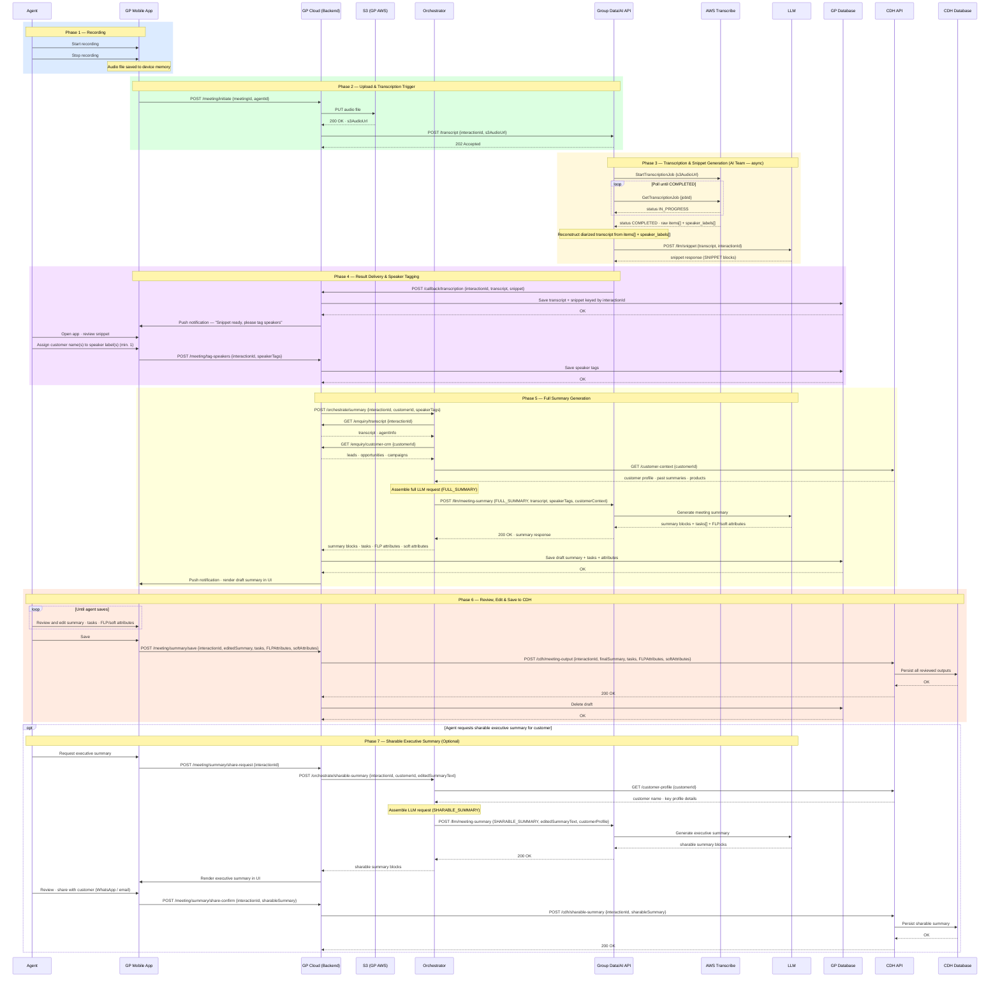

# SEQ-001: Meeting Summary Generation Flow

**Version**: 1.3
**Date**: 2026-04-21
**Status**: DRAFT

---

## Participants

| Alias | Full Name |
|---|---|
| Agent | Insurance Agent (end user) |
| Mobile | GP Mobile App |
| GP | GP Cloud (Backend) |
| S3 | S3 — GP AWS Account |
| Orch | Orchestrator (PCF Tanzu / Spring Boot) |
| AI | Group Data/AI API Layer |
| Transcribe | AWS Transcribe |
| LLM | LLM (AI Team hosted) |
| DB | GP Database |
| CDHAPI | CDH API |
| CDHDB | CDH Database |

---

## Sequence Diagram

---

## Phase Summary

| Phase | Trigger | Owner | Async? |
|---|---|---|---|
| 1 — Recording | Agent action | Agent / Mobile | No |
| 2 — Upload & Trigger | Agent stops recording | GP Backend | No |
| 3 — Transcription + Snippet | Transcript API called | AI Team | Yes (polling) |
| 4 — Delivery & Tagging | AI team callback | GP Backend | Push notification |
| 5 — Full Summary | Agent submits speaker tags | GP → Orchestrator → AI | Near-real-time |
| 6 — Edit & CDH Sync | Agent saves final summary | Agent / GP → CDH | No |
| 7 — Sharable Summary | Agent requests (optional) | GP → Orchestrator → AI | No |

---

## Key Design Notes

- **Transcript reconstruction** is performed by the AI team inside their pipeline (steps 8–9). GP receives a clean diarized string — it has no dependency on AWS Transcribe's raw JSON schema.
- **Snippet is generated by the AI team** (step 10) as part of the same async pipeline, bundled with the transcript in the callback to GP.
- **Orchestrator owns context assembly** — GP triggers Orchestrator with minimal parameters (interactionId, customerId, speakerTags). Orchestrator fetches from two sources: CDH API (customer profile, past summaries, products) and GP enquiry APIs (transcript, agent info, leads, opportunities, campaigns).
- **Persistence is split across two paths**: (1) GP DB — draft summary, tasks, and attributes temporarily while agent reviews (deleted after CDH save confirms); (2) CDH via GP → CDH API — all reviewed outputs (final summary, tasks, FLP attributes, soft attributes, sharable summary), gated by agent save/confirm action (human in the loop).
- **Orchestrator has no persistence responsibility in this flow** — it is a pure computation layer. It assembles context, calls the AI team, and returns results to GP. Direct Orchestrator → CDH persistence is reserved for chatbot conversation management (e.g., conversation compaction summaries) which is out of scope for this diagram.
- **Orchestrator is bypassed for Phases 1–4** — the async transcription and snippet pipeline (AI team) does not involve the Orchestrator. GP handles the callback and temporary storage directly.
- **GP has no direct CDH DB access** — all CDH interactions go through CDH API.
- **Speaker tagging** happens after snippet delivery and before full summary generation. The snippet uses `[spk_0]`, `[spk_1]` labels; the agent maps these to real customer names.
- **CDH sync** occurs only after the agent explicitly saves the final (edited) summary — not on draft save.
- **Sharable summary** input is `editedSummaryText` — the agent's final reviewed version, not the raw LLM output.

---

## Related Documents

- [ADR-002: Transcript Reconstruction](../risks-and-decisions/ADR-002-transcript-reconstruction.md)
- [API Contract: POST /llm/meeting-summary](../api-contracts/API-llm-meeting-summary-endpoint.md)
