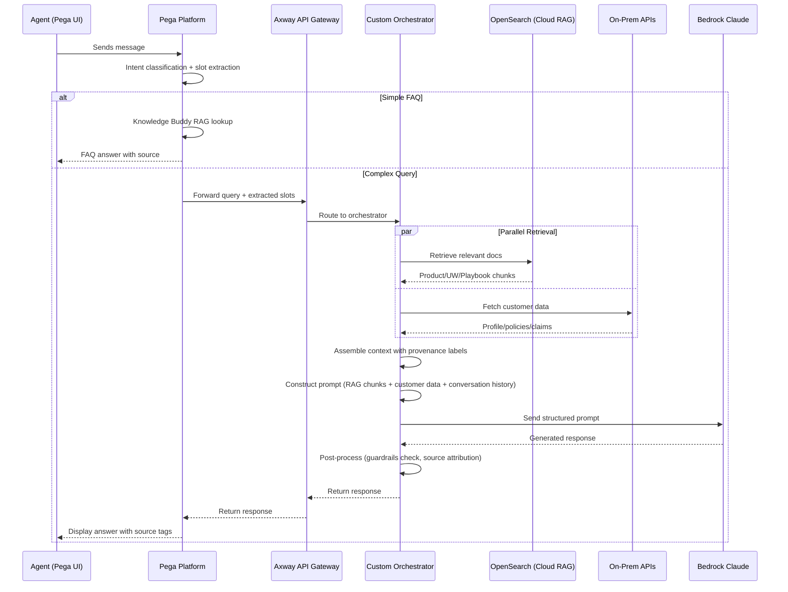

# Architecture: Chatbot Orchestrator Flow

| Field | Value |
|-------|-------|
| **Status** | Draft |
| **Derived From** | REQ-CHAT-001, REQ-CHAT-002, REQ-CHAT-003, REQ-CHAT-004, REQ-CHAT-005 |
| **Last Updated** | 2026-04-09 |
| **Author** | Tech Architect |

---

## High-Level Flow

---

## Component Responsibilities

<!-- TODO: Expand each component with detailed responsibilities, error handling, and scaling characteristics -->

### Pega Platform
- _To be detailed_

### Orchestrator
- _To be detailed_

### OpenSearch Cloud RAG
- _To be detailed_

### On-Prem APIs
- _To be detailed_

### Bedrock Claude
- _To be detailed_

---

## Design Decisions

<!-- Link to specific ADRs as they are created -->
- Routing: See `ADR-001-orchestrator-owns-rag-logic.md`
- _More to be added_

---

## Change Log

| Date | Change | Author |
|------|--------|--------|
| 2026-04-09 | Initial draft with sequence diagram | Tech Architect |
