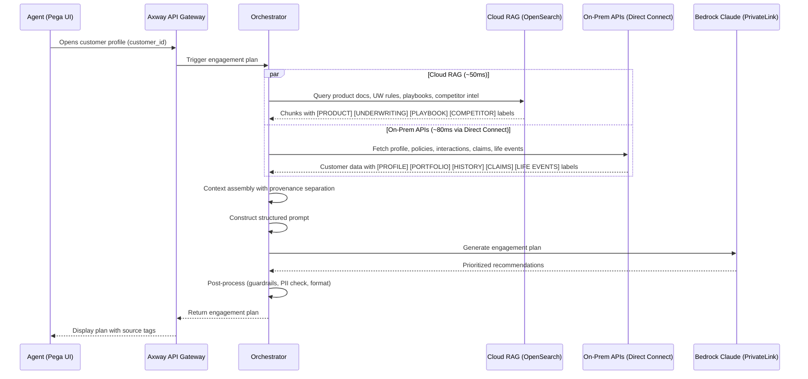
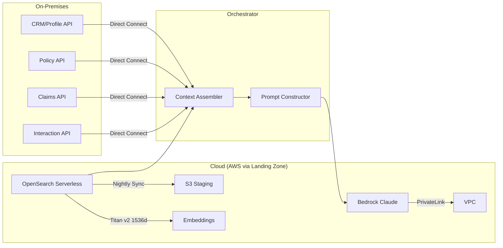

# Architecture: NBE Pattern 3 Hybrid Architecture

| Field | Value |
|-------|-------|
| **Status** | Draft |
| **Derived From** | REQ-NBE-001, REQ-NBE-002, REQ-NBE-003, REQ-NBE-004, REQ-NBE-005 |
| **Last Updated** | 2026-04-09 |
| **Author** | Tech Architect |

---

## High-Level Flow



---

## Data Path Architecture



---

## Vector DB Indexes

| Index | Content | Dimensions | Metadata Filters |
|-------|---------|------------|-----------------|
| knowledge-base | Tier 1: product docs, UW guidelines, compliance, playbooks, competitor intel | 1536 (Titan v2) | source_type, product_line[], jurisdiction (MY/SG), effective_date, is_superseded |
| interaction-summaries | Tier 2: LLM-summarised interaction embeddings | 1536 | customer_id, sentiment, interaction_date |
| customer-segments | Tier 2 (Phase 2): Customer segment embeddings | 768 | segment_type, region |

---

## Prompt Structure (Template)

<!-- TODO: Refine with actual prompt template after testing -->

```
[SYSTEM]
You are an insurance advisor assistant. Generate a prioritized engagement plan.

[KNOWLEDGE CONTEXT — from Cloud RAG]
[PRODUCT] {product_chunks}
[UNDERWRITING] {uw_chunks}
[PLAYBOOK] {playbook_chunks}
[COMPETITOR] {competitor_chunks}

[CUSTOMER CONTEXT — from On-Prem APIs]
[PROFILE] {customer_profile}
[PORTFOLIO] {existing_policies}
[HISTORY] {recent_interactions}
[CLAIMS] {claims_history}
[LIFE EVENTS] {life_events}

[INSTRUCTIONS]
1. Identify top 3 engagement opportunities ranked by priority
2. For each: provide recommendation, conversation opener, objection handling, urgency driver
3. Cite sources using provenance labels
4. Flag any data gaps
```

---

## Change Log

| Date | Change | Author |
|------|--------|--------|
| 2026-04-09 | Initial draft with Pattern 3 flows and vector DB design | Tech Architect |
