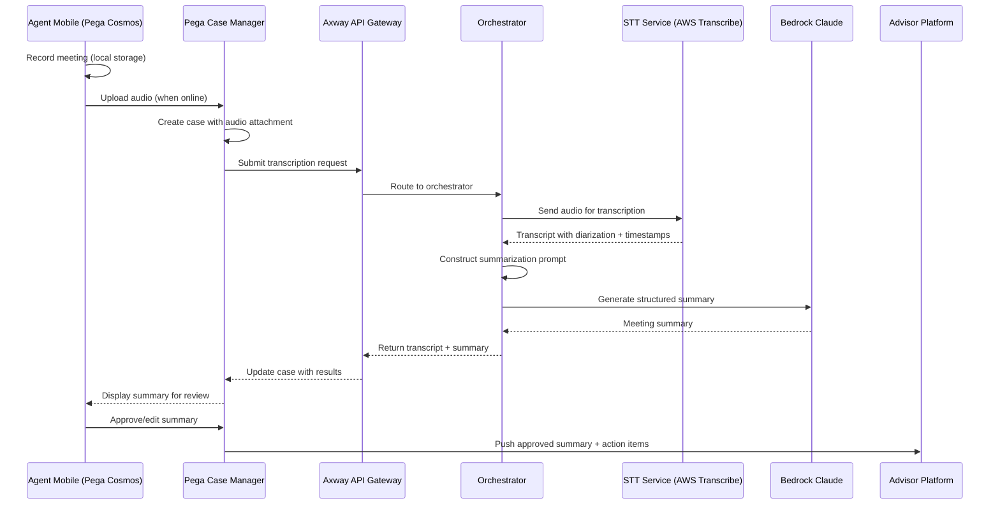
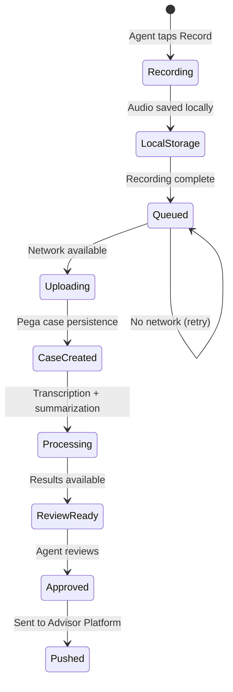

# Architecture: Voice-to-Text Meeting Assistant Flow

| Field | Value |
|-------|-------|
| **Status** | Draft |
| **Derived From** | REQ-VOICE-001, REQ-VOICE-002, REQ-VOICE-003, REQ-VOICE-004, REQ-VOICE-005, REQ-VOICE-006 |
| **Last Updated** | 2026-04-09 |
| **Author** | Tech Architect |

---

## High-Level Flow

---

## Offline Flow

---

## STT Provider Evaluation

<!-- TODO: Populate with evaluation results -->

| Criteria | AWS Transcribe | Whisper | Deepgram | AssemblyAI |
|----------|---------------|---------|----------|------------|
| Cost per minute | _TBD_ | _TBD_ | _TBD_ | _TBD_ |
| Diarization quality | _TBD_ | _TBD_ | _TBD_ | _TBD_ |
| Chinese/Malay support | _TBD_ | _TBD_ | _TBD_ | _TBD_ |
| SG data residency | _TBD_ | _TBD_ | _TBD_ | _TBD_ |
| Scale (10M mins/mo) | _TBD_ | _TBD_ | _TBD_ | _TBD_ |

---

## Change Log

| Date | Change | Author |
|------|--------|--------|
| 2026-04-09 | Initial draft with sequence and offline flow | Tech Architect |
